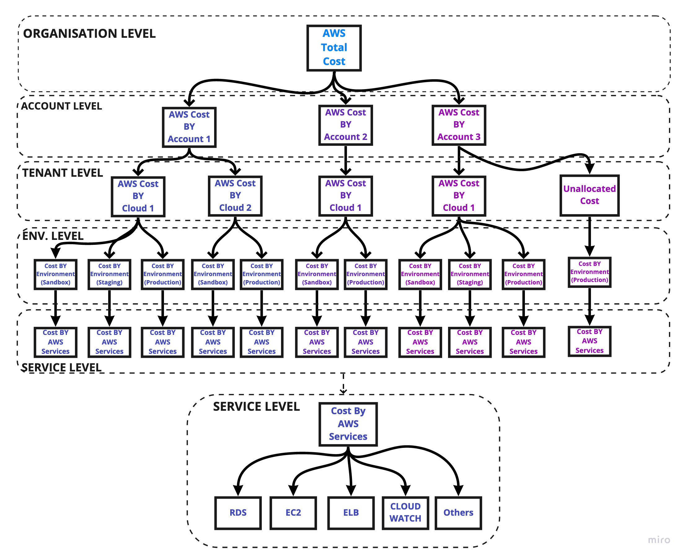

# Purpose

This is to get the aws cost from CUR file and cost explorer values using boto3 SDK and compare the cost in different levels.



# How to setup

- Install Python3 (e.g. `brew install python`)
- Change into `test` directory
- Create virtual environment:

  ```bash
  python3 -m venv venv
  ```
  (this will create a `venv` directory under `test`)

- "Activate" virtual environment:
  ```bash
  venv/bin/activate
  ```
- Install all dependencies (inside the virtualenv):
  ```bash
  pip install -r requirements.txt
  ```
- Setup your AWS config file (normally found in `~/.aws/config`):
  ```
  [default]
  aws_access_key_id = ABCDEFGHI  # <- change this
  aws_secret_access_key = AbCDeFGh # <- change this
  ```

# How to run

- Change into `test` directory
- Run main script:
```
python3 main.py --months=3
```

# Jenkins run

See [test/awscostandusage.groovy](test/awscostandusage.groovy) file.
